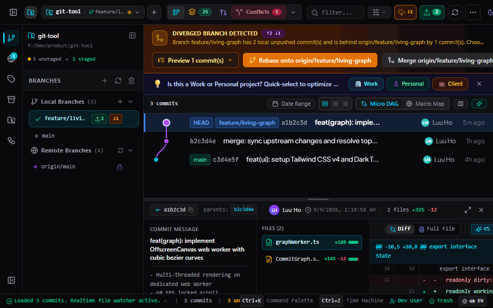
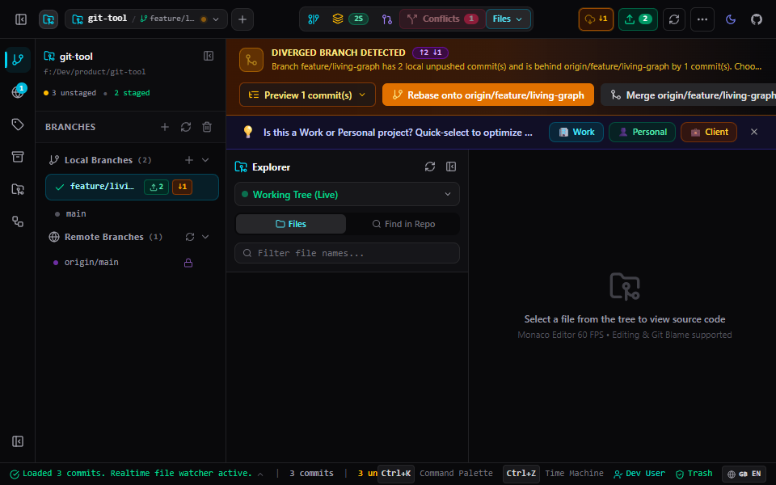

<div align="center">

# ⚡ FlowGit
### Next-Generation Visual Git Client | Ứng Dụng Quản Lý Git Đột Phá

> **The Blazing-Fast, No-Fear Git Client for Developers Who Value Their RAM and Sanity.**  
> *Lõi Rust Native • Đồ Thị 60 FPS • Kéo Thả Rebase • Thùng Rác 48h Chống Mất Mã Nguồn*

<br/>

[](https://github.com/longgoll/flow-git/stargazers)
[](https://github.com/longgoll/flow-git/releases)
[](https://github.com/longgoll/flow-git/actions)
[](LICENSE)
[](https://v2.tauri.app/)
[](https://svelte.dev/)
[](https://www.rust-lang.org/)
[]()
[]()

<br/>

**[ 🌐 Official Website ](https://longgoll.github.io/flow-git/)** &nbsp;•&nbsp; **[ 🇬🇧 Read in English ](#-english)** &nbsp;•&nbsp; **[ 🇻🇳 Đọc Tiếng Việt ](#-tiếng-việt)** &nbsp;•&nbsp; **[ 💖 Support / Ủng Hộ ](#-support-the-project)**

<br/>

<!-- Real App Action Demo GIF -->


<br/><br/>

<!-- Mini Sponsor Box -->
<table align="center" style="border: 1px solid #30363d; border-radius: 12px; background: rgba(255,255,255,0.02); display: inline-block;">
  <tr>
    <td align="center" style="border: none; padding: 6px 14px; vertical-align: middle;">
      <a href="https://ko-fi.com/longgoll" target="_blank">
        
      </a>
      <br/>
      <sub style="font-size: 11px;">☕ Buy me a coffee</sub>
    </td>
    <td style="border: none; padding: 0 6px; color: #8b949e; vertical-align: middle;">•</td>
    <td align="center" style="border: none; padding: 6px 14px; vertical-align: middle;">
      <a href="#-support-the-project">
        
      </a>
      <br/>
      <sub style="font-size: 11px;">📱 <b>MoMo:</b> *******154</sub>
    </td>
  </tr>
</table>

</div>

---

<a name="-english"></a>
# 🇬🇧 English

## 🚀 Overview & Architectural Philosophy

Git is an indispensable tool for modern software engineering, yet working with complex branching topologies, interactive rebases, and multi-file conflicts often leads to terminal friction and anxiety over accidental code loss.

While established GUI clients (such as GitKraken and GitHub Desktop) offer mature feature sets, their underlying Chromium/Electron runtimes inevitably demand **600MB – 1.4GB of RAM** and can encounter UI frame drops on large-scale repositories.

**FlowGit** takes an engineering-first, resource-conscious approach:
- **⚡ Native Rust Core:** Direct C-bindings to `libgit2` combined with **Tauri v2**. Starts in **< 400ms** and consumes **< 85MB of RAM**.
- **🛡️ 100% Data Safety (No-Fear Git):** Discarded hunks and files are automatically encrypted and snapshotted into an internal SQLite database before truncation. Hit `Ctrl + Z` to instantly undo destructive operations.
- **📊 Hardware-Accelerated 60 FPS Commit Graph:** Rendering is isolated in a dedicated Web Worker via `OffscreenCanvas`. Easily handles repositories with **> 100,000 commits** without freezing the UI thread.
- **✨ Visual Simplicity & Zero Terminal Friction:** Interactive drag-and-drop rebasing, in-memory ghost conflict simulation, 4-pane conflict resolver, and integrated Monaco editor.
- **🔄 Zero-VPS Auto Updates:** Native updates cryptographically signed with **Ed25519 keys**, distributed directly via GitHub Releases.

---

### 📊 Architectural & Performance Comparison

> *Note: Metrics measured on an Intel Core i7 / 16GB RAM system running Windows 11 with a repository containing ~35,000 commits.*

| Feature / Metric | ⚡ FlowGit (Tauri v2 + Rust) | 🌐 Chromium / Electron-based GUIs | 🏛️ Legacy Native GUIs |
| :--- | :---: | :---: | :---: |
| **Idle Memory Footprint** | **< 85 MB** | 600 MB – 1.4 GB | ~350 MB |
| **Cold Startup Time** | **< 0.4s** | 3.5s – 7.0s | 4.0s – 8.0s |
| **Graph Rendering Engine** | **OffscreenCanvas Web Worker** | DOM / SVG Elements | GDI / Direct2D legacy |
| **Uncommitted Discard Recovery** | **✅ 48-Hour SQLite Trash** | ❌ Unrecoverable | ❌ Unrecoverable |
| **Action Undo (`Ctrl + Z`)** | **✅ SQLite Reflog Time-Machine** | ⚠️ Limited / None | ❌ No |
| **Dry-Run Conflict Preview** | **✅ In-Memory Ghost Preview** | ❌ Trial & error | ❌ Trial & error |
| **Code & Diff Engine** | **Monaco Editor (VS Code core)** | Basic Text Diff | Basic Text Diff |
| **Integrated PR & Actions Studio** | **✅ Deep In-App Integration** | ⚠️ Web browser redirects | ❌ No |
| **Worktrees & Monorepo Sparse** | **✅ 1-Click Studio** | ❌ Terminal command only | ⚠️ Basic worktrees |
| **Bilingual Support (VI / EN)** | **✅ 100% Native Dual Locales** | ⚠️ Machine translated | ❌ English only |

---

## 🎯 Real-World Engineering Rescues (Where FlowGit Excels)

Here is how FlowGit protects and streamlines your daily engineering workflow during critical moments:

### 1. 🛡️ The "Accidental Discard" Rescue
- **The Scenario:** You spent 3 hours refining an algorithm across 250 lines of code. While cleaning up other files, you accidentally click *"Discard All Changes"*.
- **With Conventional GUIs:** The changes are erased from disk immediately and permanently lost.
- **With FlowGit:** FlowGit automatically snapshots all discarded hunks into an encrypted local SQLite database before truncation. Open **Trash Inspector (48h)** ➔ Click **Restore** ➔ Your uncommitted code is 100% recovered in 1 second.

### 2. ⏳ The "Destructive Reset / Messy Rebase" Rollback
- **The Scenario:** You run a hard reset or rebase onto the wrong upstream branch, leaving your local branches detached or scrambled.
- **With Conventional GUIs:** You must open terminal, decipher `git reflog`, locate the old SHA, and manually reset the branch head.
- **With FlowGit:** Simply press **`Ctrl + Z`** (Time Machine). FlowGit reads its internal Action Journal, calculates the previous reflog pointer, and restores your branch tip instantly.

### 3. 🚀 The "Large Monorepo Lag" Solution
- **The Scenario:** You open a company monorepo or an open-source project with tens of thousands of commits (like Chromium or Linux kernel). Traditional GUIs freeze, peg your CPU at 100%, and take seconds to scroll.
- **With FlowGit:** FlowGit offloads graph topology calculation to Rust threads (`rayon`) and delegates all canvas rendering to an isolated Web Worker via `OffscreenCanvas`. Scrolling remains locked at 60 FPS, and RAM stays under 85MB.

### 4. ⚡ The "Urgent Production Hotfix" Workflow
- **The Scenario:** You are midway through a complex feature with 15 uncommitted files when production reports a critical bug requiring immediate patching.
- **With Conventional GUIs:** You must stash your work, pray that `git stash pop` does not create nasty merge conflicts later, checkout the release tag, and patch.
- **With FlowGit:** Click **Quick Hotfix** or open **Git Worktrees**. FlowGit creates an isolated linked working directory in 1 click, allowing you to fix, test, and push the patch while leaving your ongoing work completely untouched.

### 5. ⚔️ The "Multi-File Merge Conflict" Nightmare
- **The Scenario:** Merging a long-lived feature branch results in 20 conflicted files packed with messy `<<<<<<< HEAD`, `=======`, and `>>>>>>>` markers.
- **With Conventional GUIs:** Editing raw markers in terminal or basic diff tools is prone to accidental line deletions and human errors.
- **With FlowGit:** The **4-Pane Conflict Resolver** presents **Ours**, **Base**, **Theirs**, and the live **Result** side-by-side with Monaco syntax highlighting. Click individual blocks or choose *"Take Ours / Theirs"* with full confidence.

### 6. 🧹 The "Accidentally Committed Secret (.env)" Emergency
- **The Scenario:** An API key, database password, or `.env` file was committed 10 commits ago.
- **With Conventional GUIs:** You have to search StackOverflow for dangerous `git filter-branch` or external BFG tools that risk corrupting your repository.
- **With FlowGit:** Open **History Nuker**, type the file name, and FlowGit automatically purges the sensitive file across every historical commit in seconds.

---

## 🌟 18 Feature Suites • 40+ Advanced Git Capabilities

FlowGit organizes its extensive technical feature set across **6 Core Engineering Pillars** (backed by 18 in-depth specifications in [`docs/features/`](./docs/features/)):

#### 📊 1. Core Graph & History Engine
- **Living Commit Graph (60 FPS Locked):** Virtual scrolling rendered via `OffscreenCanvas` in a dedicated Web Worker; Bézier curve routing compacted with Rust `rayon`. ([docs](./docs/features/commit-graph-and-dag.md))
- **DAG Mini-Map & Timeline Navigator:** Birds-eye radar view across branching topologies for rapid 1-click navigation. ([docs](./docs/features/commit-graph-and-dag.md))
- **In-Memory Ghost Preview:** Drag-and-drop commit simulation detecting merge/rebase conflicts before mouse release. ([docs](./docs/features/commit-graph-and-dag.md))
- **Branch Pinning (⭐) & Visibility Toggles (👁️):** Pin primary branches (main, prod) and toggle visibility of obsolete feature branches. ([docs](./docs/features/commit-graph-and-dag.md))
- **Graph Density Zoom:** Toggle between Compact mode for massive topology overviews and Comfortable mode for detailed reading. ([docs](./docs/features/commit-graph-and-dag.md))
- **Visual Interactive Rebase Studio:** Drag-and-drop timeline supporting `Pick`, `Reword`, `Drop`, `Squash`, and `Fixup` with dry-run safety. ([docs](./docs/features/rebase-and-history-ops.md))
- **Stacked Commits Studio:** Groom and reorder unpushed commit chains before submitting upstream pull requests. ([docs](./docs/features/stacked-commits-and-hotfix.md))
- **1-Click Cherry-Pick & Fast-Forward:** Instant cherry-picking with ancestor tree resolution and conflict pre-checks. ([docs](./docs/features/rebase-and-history-ops.md))

#### 🛡️ 2. Safety Core & Data Recovery Engine
- **Safe Discard Engine (48h SQLite Trash):** Automated SQLite snapshot of all discarded hunks with 1-click restoration within 48 hours. ([docs](./docs/architecture/safety-engine.md))
- **Reflog Time Machine (`Ctrl + Z`):** Omnipresent undo engine that safely reverts resets, checkouts, and failed rebases. ([docs](./docs/architecture/safety-engine.md))
- **Index Lock Deadlock Hunter:** Automatically identifies and terminates crashed CLI handles holding stale `.git/index.lock`. ([docs](./docs/features/edge-cases-and-guards.md))
- **Windows File Lock Guard:** Detects external file handles (VS Code, Antivirus) to prevent corrupted checkouts. ([docs](./docs/features/edge-cases-and-guards.md))
- **Pre-Commit Secret Blocker:** Alerts and halts accidental commits containing `.env`, private keys, or files > 50MB. ([docs](./docs/features/edge-cases-and-guards.md))
- **Git Playbook & Emergency Doctor:** 1-Click interactive doctor repairing Detached HEAD, hung rebases, and corrupt refs. ([docs](./docs/features/onboarding-and-playbook.md))

#### 🔍 3. Code Review, Monaco Diff & Conflict Solver
- **Monaco Diff Editor (Split & Unified):** VS Code-grade diff engine featuring side-by-side Split and Unified views with full syntax highlighting. ([docs](./docs/features/working-tree-and-diff.md))
- **Surgical Line & Hunk Staging:** Craft immaculate commits by pressing `Space` or clicking to stage/unstage individual lines or hunks. ([docs](./docs/features/working-tree-and-diff.md))
- **Protected Hunk Discard:** Discard scrap lines directly in the diff viewer, preserved in SQLite 48h trash just in case. ([docs](./docs/features/working-tree-and-diff.md))
- **4-Pane 3-Way Conflict Resolver:** Clean separation of Ours, Base, Theirs, and Result preview with 1-click chunk adoption. ([docs](./docs/features/conflict-and-bisect.md))
- **Visual Git Bisect Wizard:** Automated binary search wizard splitting the commit graph to isolate bugs in minutes. ([docs](./docs/features/conflict-and-bisect.md))
- **Native Commit Composer:** Built-in composer with commit templates, Amend, Co-Author attribution, and native emoji picker. ([docs](./docs/features/working-tree-and-diff.md))

#### 🗂️ 4. Advanced Git & Monorepo Operations
- **Repository Explorer:** Browse directory trees and inspect syntax-highlighted code at any historical commit without checkout. ([docs](./docs/features/repo-explorer-and-file-tools.md))
- **Interactive Line-by-Line Blame:** Inspect author, commit hash, date, and message with hover tooltips and jump-to-commit links. ([docs](./docs/features/repo-explorer-and-file-tools.md))
- **2-Commit & Branch Comparison Studio:** Deep side-by-side file tree and Monaco diff comparison between any two points, 100% offline. ([docs](./docs/features/repo-explorer-and-file-tools.md))
- **Single File History Timeline:** Track chronological mutations of an isolated file across years of repository evolution. ([docs](./docs/features/repo-explorer-and-file-tools.md))
- **History Nuker (Sensitive Data Eraser):** 1-Click recursive purge permanently scrubbing `.env` credentials and large files across 100% history. ([docs](./docs/features/repo-explorer-and-file-tools.md))
- **Git Worktrees Parallel Studio:** Work on multiple branches simultaneously in isolated physical directories without stashing. ([docs](./docs/features/advanced-tools.md))
- **1-Click Quick Hotfix:** Spawn a temporary worktree from main to hotfix and deploy, with automatic cleanup post-merge. ([docs](./docs/features/stacked-commits-and-hotfix.md))
- **Git LFS Engine & Remote File Locking:** Download binary payloads and lock unmergeable assets (Unreal, Unity, PSD) on remotes. ([docs](./docs/features/advanced-tools.md))
- **Git Submodules Hub:** Visually initialize, recursively update, and synchronize nested submodule repositories. ([docs](./docs/features/advanced-tools.md))
- **Monorepo Sparse Checkout Studio:** Configure Cone Mode sparse checkouts to download only designated directories in massive monorepos. ([docs](./docs/features/sparse-checkout-and-lfs.md))
- **Visual Git Hooks Manager:** Inspect, activate, and edit client-side automation scripts (`pre-commit`, `commit-msg`, `pre-push`). ([docs](./docs/features/advanced-tools.md))

#### 🌐 5. Cloud Remotes, CI/CD & Security
- **Multi-Remote Adapters & Smart Sync:** Connect GitHub, GitLab, Bitbucket, Gitea with background fetch/rebase and `↑ 2 ↓ 5` sync badges. ([docs](./docs/features/branches-and-remotes.md))
- **GitHub Pull Request Workspace:** Browse PRs, review Monaco diffs, submit inline review comments, and merge without a browser. ([docs](./docs/features/github-and-pull-requests.md))
- **GitHub Actions CI/CD Studio:** Monitor workflow runs in real-time, inspect job step trees, stream ANSI logs, and rerun failed jobs. ([docs](./docs/features/github-actions-integration.md))
- **GPG & SSH Commit Signing:** Cryptographically sign commits using GPG or SSH keys and display enterprise Verified badges. ([docs](./docs/features/remote-providers-and-signing.md))
- **Native OS Keychain Auth:** Secure OAuth Device Flow and PAT token storage in Windows Credential Manager and macOS Keychain. ([docs](./docs/features/auth-and-identity.md))
- **Per-Repository Identity Switcher:** Bind specific User Name, Email, and SSH keys per repository to prevent work/personal mix-ups. ([docs](./docs/features/auth-and-identity.md))
- **Git Tag Lifecycle Studio:** Create lightweight or annotated release tags with granular controls to push individual or all tags. ([docs](./docs/features/branches-and-remotes.md))
- **Stash Shelf Inspector:** Inspect diffs of individual files tucked inside stashes before popping or applying. ([docs](./docs/features/branches-and-remotes.md))
- **Patch File Manager:** Export commits to `.patch` files and import external patches using 3-way merge with dry-run validation. ([docs](./docs/features/patch-file-manager.md))

#### ⚡ 6. Developer Experience, Insights & Core Performance
- **Repository Pulse & Insights Studio:** 52-week activity heatmap, Code Churn & Hotspot analysis, and contributor impact leaderboards. ([docs](./docs/features/repo-insights-and-statistics.md))
- **Universal Command Palette (`Ctrl + K`):** Fuzzy-search and execute over 50+ Git commands at lightspeed without touching the mouse. ([docs](./docs/guides/user-manual.md))
- **Realtime Multi-Criteria Search & Filter:** Filter history instantly by Author, SHA, commit message, date ranges, or file paths. ([docs](./docs/features/commit-graph-and-dag.md))
- **Curated Multi-Theme Engine:** 5 tailored themes: Dark Modern, Tokyo Night, GitHub Dark, Catppuccin, and Clean Light. ([docs](./docs/main.md))
- **Strict Dual i18n System (VI & EN):** 100% of UI strings, error alerts, and tooltips localized in native Vietnamese and standard English. ([docs](./docs/features/onboarding-and-playbook.md))
- **Local AI Assistant (Ollama / Local LLM):** Generate Conventional Commit messages from diffs and explain complex conflict resolutions 100% offline. ([docs](./docs/features/ai-assistant.md))
- **Native Rust + Tauri v2 Core:** Installer under 35MB, memory footprint < 85MB RAM, cold launch in < 0.4s, and automated updates. ([docs](./docs/architecture/overview.md))

---

### 📸 Visual Feature Showcase

| 🛡️ 48-Hour Safe Discard Trash | ⚡ Side-by-Side Monaco Diff |
| :---: | :---: |
|  |  |
| **⚔️ 4-Pane Conflict Resolver** | **⏳ Reflog Time Machine (`Ctrl + Z`)** |
|  |  |
| **🔍 Repository File Explorer** | **⌨️ Command Palette (`Ctrl + K`)** |
|  |  |

---

## ⌨️ Essential Shortcuts Cheat Sheet

| Shortcut | Action |
| :--- | :--- |
| `Ctrl + K` / `Cmd + K` | Open Universal Command Palette |
| `Ctrl + Z` / `Cmd + Z` | Undo last Git action (Time Machine) |
| `Ctrl + Shift + Z` | Redo undone Git action |
| `Space` | Stage / Unstage selected file, hunk, or line |
| `S` (on multi-select) | Squash selected commits |
| `Ctrl + Shift + F` | Global Commit & File Search |
| `F1` | In-App Interactive User Guide & Playbook |
| `Ctrl + R` | Force refresh repository state |

---

## 💻 Installation & Quick Start

### Windows (Recommended)
- **Microsoft Store:** Search for `FlowGit` or visit [Microsoft Store Page](https://apps.microsoft.com/search?query=FlowGit).
- **GitHub Release (.exe / .msi):** Download the latest installer from [Releases](https://github.com/longgoll/flow-git/releases/latest).

### Build from Source
```bash
# 1. Clone repository
git clone https://github.com/longgoll/flow-git.git
cd flow-git

# 2. Install dependencies
npm install

# 3. Run in development mode (with Hot Module Replacement)
npm run tauri dev

# 4. Build standalone production installer
npm run tauri build
```

---

<br/><br/>

---

<a name="-tiếng-việt"></a>
# 🇻🇳 Tiếng Việt

## 🚀 Tổng Quan & Triết Lý Thiết Kế

Git là công cụ không thể thiếu trong phát triển phần mềm hiện đại, nhưng việc xử lý các nhánh phân nhánh phức tạp, rebase lịch sử hay giải quyết xung đột mã nguồn thường mang lại nhiều phiền phức trong terminal và nỗi lo lắng về việc vô tình làm mất mã nguồn.

Các công cụ Git GUI lâu năm (như GitKraken hay GitHub Desktop) có hệ sinh thái rất phong phú và giao diện chỉn chu. Tuy nhiên, việc đóng gói kèm toàn bộ trình duyệt Chromium và Node.js runtime trong Electron khiến ứng dụng thường chiếm dụng **600MB – 1.4GB RAM** và có thể gặp hiện tượng giảm khung hình khi làm việc với các kho mã nguồn quy mô lớn.

**FlowGit** được thiết kế dựa trên tư duy kỹ thuật tối ưu và tôn trọng tài nguyên hệ thống:
- **⚡ Lõi Native Rust Siêu Tốc:** Liên kết trực tiếp thư viện C `libgit2` kết hợp cùng **Tauri v2**. Khởi động trong **< 0.4 giây** và ngốn chưa tới **85MB RAM**.
- **🛡️ Tuyệt Đối An Toàn (No-Fear Git):** Mọi đoạn mã hoặc tệp tin bị Discard đều được tự động snapshot vào SQLite cục bộ trước khi xóa. Hoàn tác nhanh mọi thao tác nguy hiểm bằng **`Ctrl + Z`**.
- **📊 Đồ Thị 60 FPS Khóa Cứng:** Tách riêng tác vụ vẽ đồ thị sang Web Worker thông qua `OffscreenCanvas`. Vận hành mượt mà kho chứa trên **100.000 commits** mà không làm đơ giật giao diện.
- **✨ Trực Quan Hóa & Giảm Ma Sát Terminal:** Kéo thả Interactive Rebase, mô phỏng xung đột trước khi nhả chuột (Ghost Preview), giải quyết xung đột 4 khung hình và trình biên tập Monaco Diff.
- **🔄 Tự Động Cập Nhật 0 Đồng:** Cập nhật ngầm ký số bằng mật mã **Ed25519** qua GitHub Releases, không tốn chi phí duy trì máy chủ.

---

### 📊 Bảng So Sánh Kiến Trúc & Hiệu Năng

> *Lưu ý: Số liệu đo đạc thực tế trên hệ thống Intel Core i7 / 16GB RAM chạy Windows 11 với repository chứa ~35.000 commits.*

| Tiêu Chí / Tính Năng | ⚡ FlowGit (Tauri v2 + Rust) | 🌐 Ứng Dụng Nền Tảng Chromium / Electron | 🏛️ Công Cụ Git GUI Truyền Thống |
| :--- | :---: | :---: | :---: |
| **Mức Chiếm Dụng RAM (Idle)** | **< 85 MB** | 600 MB – 1.4 GB | ~350 MB |
| **Thời Gian Khởi Động** | **< 0.4 giây** | 3.5s – 7.0s | 4.0s – 8.0s |
| **Động Cơ Đồ Thị** | **OffscreenCanvas Web Worker** | Thẻ DOM / SVG thông thường | GDI / Direct2D cũ |
| **Cứu Mã Nguồn Discard Nhầm** | **✅ Thùng rác SQLite 48h** | ❌ Mất vĩnh viễn | ❌ Mất vĩnh viễn |
| **Hoàn Tác Nhanh (`Ctrl + Z`)** | **✅ Time Machine Toàn Diện** | ⚠️ Hạn chế / Không có | ❌ Không hỗ trợ |
| **Mô Phỏng Xung Đột Trước** | **✅ In-Memory Ghost Preview** | ❌ Thử sai trực tiếp | ❌ Thử sai trực tiếp |
| **Trình So Sánh Mã Nguồn** | **Monaco Editor (Chuẩn VS Code)** | Trình xem Diff cơ bản | Giao diện text cổ điển |
| **Tích Hợp PR & CI/CD Actions** | **✅ Trực Tiếp Trong Ứng Dụng** | ⚠️ Điều hướng mở trình duyệt | ❌ Không hỗ trợ |
| **Worktrees & Monorepo Sparse**| **✅ Studio Trực Quan 1-Click** | ❌ Phải gõ Terminal | ⚠️ Worktree cơ bản |
| **Hỗ Trợ Song Ngữ (VI/EN)** | **✅ 100% Bản Ngữ Chuẩn Dev** | ⚠️ Dịch máy | ❌ Chỉ có tiếng Anh |

---

## 🎯 Tình Huống Thực Tế Thường Gặp (Nơi FlowGit Phát Huy Giá Trị)

Dưới đây là các bài toán thực tế mà bất kỳ kỹ sư phần mềm nào cũng từng gặp phải và cách FlowGit giải quyết triệt để:

### 1. 🛡️ Cứu Nguy Lỡ Tay Bấm "Discard All Changes"
- **Tình huống:** Bạn viết mã suốt cả buổi sáng hơn 250 dòng nhưng chưa kịp commit. Trong lúc dọn dẹp các tệp thừa, bạn lỡ tay bấm nhầm nút *"Discard All Changes"*.
- **Với công cụ thông thường:** Toàn bộ công sức cả buổi sáng biến mất vĩnh viễn, không có cách nào lấy lại.
- **Với FlowGit:** FlowGit tự động snapshot mọi đoạn mã bị discard vào cơ sở dữ liệu SQLite trước khi xóa. Mở **Trash Inspector 48h** ➔ Bấm **Restore** ➔ Mã nguồn được phục hồi nguyên vẹn trong 1 giây.

### 2. ⏳ Cứu Nguy Khi Reset Nhầm Hoặc Rebase Bị Xung Đột Loạn
- **Tình huống:** Bạn chạy lệnh hard reset hoặc rebase nhầm nhánh, làm trôi mất các commit quan trọng hoặc lịch sử nhánh bị đảo lộn.
- **Với công cụ thông thường:** Bạn phải mở terminal, tra cứu `git reflog`, tìm mã băm SHA cũ và gõ lệnh reset thủ công rất căng thẳng.
- **Với FlowGit:** Chỉ cần bấm **`Ctrl + Z`** (Time Machine). FlowGit đọc Action Journal nội bộ, tự động đưa con trỏ nhánh quay ngược về trạng thái trước đó an toàn tuyệt đối.

### 3. 🚀 Giải Quyết Triệt Để Tình Trạng Giật Lag Với Repo Khổng Lồ
- **Tình huống:** Mở kho mã nguồn monorepo hoặc repository lớn hàng chục nghìn commits (như Linux kernel hay các dự án doanh nghiệp lớn). Giao diện các app cũ thường bị đơ, quạt tản nhiệt quay to.
- **Với FlowGit:** FlowGit đẩy toàn bộ việc tính toán luồng nhánh sang luồng đa nhiệm Rust (`rayon`) và render đồ thị bằng **OffscreenCanvas** trên Web Worker độc lập. Giao diện luôn khóa cứng ở 60 khung hình/giây và RAM duy trì dưới 85MB.

### 4. ⚡ Vá Lỗi Production Khẩn Cấp Khi Đang Code Dở
- **Tình huống:** Bạn đang sửa dở 15 tệp tin tính năng mới thì máy chủ production báo lỗi nghiêm trọng cần vá gấp trong 10 phút.
- **Với công cụ thông thường:** Bạn phải chạy `git stash`, chuyển nhánh vá lỗi, rồi quay lại `git stash pop` với nỗi sợ xung đột mã nguồn dở dang.
- **Với FlowGit:** Mở **Quick Hotfix** hoặc **Git Worktrees**. FlowGit tạo một thư mục làm việc song song hoàn toàn độc lập chỉ với 1 click, giúp bạn vá lỗi, kiểm thử và deploy mà không cần đụng đến mã nguồn đang viết dở.

### 5. ⚔️ Gỡ Rối Xung Đột Hợp Nhất (Merge Conflicts) Phức Tạp
- **Tình huống:** Nhập nhánh tính năng dài ngày phát sinh hàng chục tệp xung đột với các dấu `<<<<<<< HEAD`, `=======`, `>>>>>>>` rối mắt.
- **Với công cụ thông thường:** Chỉnh sửa trực tiếp trên file text rất dễ xóa nhầm logic của đồng đội.
- **Với FlowGit:** Trình **4-Pane Conflict Resolver** hiển thị song song **Ours (Mã của bạn)**, **Base (Gốc)**, **Theirs (Mã nhánh gộp)** và **Result (Kết quả)** kèm highlight cú pháp Monaco. Chọn từng khối mã hoặc bấm *"Take Ours / Theirs"* nhanh chóng và chính xác.

### 6. 🧹 Tẩy Xóa Dữ Liệu Nhạy Cảm (.env, API Keys) Lỡ Commit
- **Tình huống:** Bạn vô tình commit tệp `.env` hoặc API Key mật lên Git vài commit trước đó.
- **Với công cụ thông thường:** Bạn phải tìm kiếm các lệnh CLI phức tạp như `git filter-branch` hay cài đặt công cụ BFG bên ngoài với nguy cơ làm hỏng repo.
- **Với FlowGit:** Mở **History Nuker**, điền tên tệp cần xóa, FlowGit sẽ quét đệ quy và tẩy sạch hoàn toàn tệp nhạy cảm khỏi mọi commit trong lịch sử chỉ sau vài giây.

---

## 🌟 18 Chuyên Đề • Hơn 40+ Tính Năng Kỹ Thuật Đỉnh Cao

FlowGit quy tụ kho tính năng phong phú được phân bổ bài bản theo **6 Trụ Cột Kỹ Thuật Cốt Lõi** (tương ứng 18 bộ đặc tả chuyên sâu tại [`docs/features/`](./docs/features/)):

#### 📊 1. Trụ Cột Đồ Thị Động Học & Lịch Sử (Core Graph & History)
- **Living Commit Graph (Khóa cứng 60 FPS):** Virtual scrolling tối ưu qua `OffscreenCanvas` trên Web Worker; đường cong Bézier tính toán song song với Rust `rayon`. ([docs](./docs/features/commit-graph-and-dag.md))
- **Bản Đồ Thu Nhỏ DAG Mini-Map:** Giao diện radar toàn cảnh lịch sử repository giúp định vị nhanh vị trí nhánh, HEAD và các mốc tag. ([docs](./docs/features/commit-graph-and-dag.md))
- **Mô Phỏng Ghost Preview Kéo - Thả:** Kéo thả commit mô phỏng trước kết quả Merge/Rebase và phát hiện xung đột trước khi nhả chuột. ([docs](./docs/features/commit-graph-and-dag.md))
- **Ghim Nhánh (⭐) & Lọc Ẩn/Hiện (👁️):** Ghim nhánh quan trọng (main, prod) lên đầu và ẩn các nhánh tính năng cũ để giữ không gian làm việc gọn gàng. ([docs](./docs/features/commit-graph-and-dag.md))
- **Điều Chỉnh Mật Độ Đồ Thị (Graph Density):** Phóng to thu nhỏ giữa Compact mode (nhìn bao quát) và Comfortable mode (đọc chi tiết). ([docs](./docs/features/commit-graph-and-dag.md))
- **Visual Interactive Rebase Studio:** Timeline kéo thả trực quan hỗ trợ `Pick`, `Reword`, `Drop`, `Squash`, `Fixup` với chế độ Dry-Run an toàn. ([docs](./docs/features/rebase-and-history-ops.md))
- **Stacked Commits Studio:** Sắp xếp chuỗi commit chưa push bằng kéo thả hoặc phím bấm trước khi tạo Pull Request. ([docs](./docs/features/stacked-commits-and-hotfix.md))
- **1-Click Cherry-Pick & Fast-Forward:** Nhặt commit sang nhánh hiện tại với 1 thao tác duy nhất, tự động nhận diện quan hệ gia phả. ([docs](./docs/features/rebase-and-history-ops.md))

#### 🛡️ 2. Trụ Cột An Toàn Tuyệt Đối & Khôi Phục Dữ Liệu (Safety Core)
- **Thùng Rác Safe Discard 48h:** Tự động snapshot mã nguồn bị xóa vào SQLite, khôi phục 100% trong vòng 48 giờ qua Trash Inspector. ([docs](./docs/architecture/safety-engine.md))
- **Cỗ Máy Thời Gian Reflog Time Machine (`Ctrl + Z`):** Hoàn tác tức thì trạng thái nhánh về trước đó khi lỡ tay Reset, Rebase hỏng hoặc Merge nhầm. ([docs](./docs/architecture/safety-engine.md))
- **Index Lock Deadlock Hunter:** Tự động phát hiện và giải phóng an toàn file khóa `.git/index.lock` bị kẹt khi CLI bị crash. ([docs](./docs/features/edge-cases-and-guards.md))
- **Windows File Lock & Antivirus Guard:** Bắt trước các file handle đang bị IDE hoặc Antivirus chiếm dụng, ngăn ngừa checkout dở dang. ([docs](./docs/features/edge-cases-and-guards.md))
- **Bộ Chặn Rò Rỉ Bí Mật (Pre-Commit Guard):** Cảnh báo và ngăn chặn ngay nếu stage file mật (`.env`, `id_rsa`, pem keys) hoặc file > 50MB. ([docs](./docs/features/edge-cases-and-guards.md))
- **Git Playbook & Bác Sĩ Cứu Hộ Khẩn Cấp:** Sổ tay tương tác chẩn đoán và sửa chữa 1-chạm: gỡ Detached HEAD, hủy rebase kẹt, dọn rác repo. ([docs](./docs/features/onboarding-and-playbook.md))

#### 🔍 3. Trụ Cột Soi Code, Staging & Xử Lý Xung Đột (Code & Diff)
- **Monaco Diff Editor (Split & Unified):** Trình so sánh code chuẩn VS Code với 2 chế độ Song Song hoặc Hợp Nhất, tô màu cú pháp chuẩn xác. ([docs](./docs/features/working-tree-and-diff.md))
- **Stage / Unstage Từng Dòng & Từng Khối:** Bấm phím `Space` hoặc click chuột để stage từng dòng hoặc từng khối mã (hunk) độc lập. ([docs](./docs/features/working-tree-and-diff.md))
- **Xóa Khối Mã Có Bảo Hiểm:** Loại bỏ code thừa ngay trên trình diff, dữ liệu xóa vẫn được lưu vào thùng rác SQLite 48h đề phòng hối hận. ([docs](./docs/features/working-tree-and-diff.md))
- **Trình Xử Lý Xung Đột 4 Vùng (3-Way Conflict Resolver):** Tách bạch Ours, Base, Theirs và Result kèm Monaco syntax, nhận block 1-click không lo sót marker `<<<<<<<`. ([docs](./docs/features/conflict-and-bisect.md))
- **Visual Git Bisect Wizard:** Thuật toán binary search chia đôi đồ thị, hướng dẫn tìm ra commit gây lỗi chỉ sau 4–5 bước kiểm tra. ([docs](./docs/features/conflict-and-bisect.md))
- **Native Commit Composer:** Hỗ trợ commit templates, Amend 1-click, gán thẻ Co-Authors và bộ chọn Emoji tích hợp sẵn. ([docs](./docs/features/working-tree-and-diff.md))

#### 🗂️ 4. Trụ Cột Khám Phá File & Vận Hành Nâng Cao (Advanced & Monorepo)
- **Duyệt Cây File Quá Khứ (Repo Explorer):** Khám phá cấu trúc thư mục và đọc code tại bất kỳ commit nào mà không cần checkout làm bẩn working tree. ([docs](./docs/features/repo-explorer-and-file-tools.md))
- **Interactive Line-by-Line Blame:** Soi rõ tác giả, commit hash, ngày giờ cho từng dòng code kèm tooltip chi tiết và link mở commit. ([docs](./docs/features/repo-explorer-and-file-tools.md))
- **So Sánh 2 Commit Hoặc 2 Nhánh Tùy Ý:** So sánh toàn diện file tree và Monaco Diff giữa hai điểm bất kỳ trong lịch sử 100% offline. ([docs](./docs/features/repo-explorer-and-file-tools.md))
- **Dòng Thời Gian Lịch Sử Đơn Tệp (File History):** Theo dõi toàn bộ quá trình biến động của 1 tệp tin duy nhất xuyên suốt nhiều năm phát triển. ([docs](./docs/features/repo-explorer-and-file-tools.md))
- **History Nuker (Tẩy Xóa File Bí Mật Vĩnh Viễn):** 1-Click quét đệ quy và xóa sạch triệt để file nhạy cảm (`.env`, token) khỏi 100% lịch sử Git. ([docs](./docs/features/repo-explorer-and-file-tools.md))
- **Git Worktrees Đa Nhiệm Song Song:** Mở song song nhiều workspace cho các nhánh khác nhau mà không cần stash code dở dang. ([docs](./docs/features/advanced-tools.md))
- **1-Click Quick Hotfix Studio:** Tự động mở worktree tạm từ main để sửa bug khẩn cấp và tự dọn dẹp sau khi merge. ([docs](./docs/features/stacked-commits-and-hotfix.md))
- **Quản Lý Tệp Lớn Git LFS & Khóa File:** Quản lý tải payload nhị phân và khóa tệp trên server (Game Dev, 3D, Design) chống xung đột. ([docs](./docs/features/advanced-tools.md))
- **Trung Tâm Git Submodules Hub:** Khởi tạo, cập nhật đệ quy và đồng bộ các kho con lồng nhau một cách trực quan. ([docs](./docs/features/advanced-tools.md))
- **Monorepo Sparse Checkout Studio:** Cấu hình Cone Mode để chỉ tải các thư mục cần thiết trong monorepo lớn, tiết kiệm đĩa tối đa. ([docs](./docs/features/sparse-checkout-and-lfs.md))
- **Trình Quản Lý Git Hooks Trực Quan:** Kiểm tra, kích hoạt và sửa đổi các script tự động hóa (`pre-commit`, `commit-msg`, `pre-push`). ([docs](./docs/features/advanced-tools.md))

#### 🌐 5. Trụ Cột Đám Mây, CI/CD & Bảo Mật (Cloud, CI/CD & Security)
- **Đa Nền Tảng Multi-Remote & Smart Sync:** Quản lý GitHub, GitLab, Bitbucket, Gitea với Smart Sync tự động fetch/rebase ngầm và badge `↑ 2 ↓ 5`. ([docs](./docs/features/branches-and-remotes.md))
- **GitHub Pull Request Workspace:** Duyệt PR, đọc Monaco diff, nhận xét nội dòng và merge trực tiếp trong app không cần mở trình duyệt. ([docs](./docs/features/github-and-pull-requests.md))
- **GitHub Actions CI/CD Studio:** Giám sát tiến độ workflow runs, xem cây Job Steps, đọc ANSI log trực tiếp và bấm Re-run job lỗi 1-click. ([docs](./docs/features/github-actions-integration.md))
- **Xác Thực Ký Số GPG & SSH Commit:** Ký số bảo mật cho commit, kiểm tra tính toàn vẹn và hiển thị huy hiệu `Verified` uy tín. ([docs](./docs/features/remote-providers-and-signing.md))
- **Xác Thực An Toàn Native OS Keychain:** Đăng nhập an toàn qua OAuth Device Flow và PAT, mã hóa trong Windows Credential Manager / macOS Keychain. ([docs](./docs/features/auth-and-identity.md))
- **Chuyển Đổi Danh Tính Theo Từng Repo:** Áp dụng đúng User Name, Email và SSH key cho từng repo, tránh nhầm lẫn việc công ty vs việc cá nhân. ([docs](./docs/features/auth-and-identity.md))
- **Quản Lý Vòng Đời Git Tag:** Tạo thẻ Lightweight / Annotated có ký số, đẩy chọn lọc từng tag hoặc đẩy toàn bộ tags lên remote server. ([docs](./docs/features/branches-and-remotes.md))
- **Kệ Lưu Nháp Stash Shelf Inspector:** Xem trước diff chi tiết của từng tệp bên trong stash trước khi Pop hoặc Apply. ([docs](./docs/features/branches-and-remotes.md))
- **Trình Quản Lý & Áp Dụng Tệp Patch:** Xuất commit thành tệp `.patch` và áp dụng patch 3-way với chế độ kiểm tra Dry-Run trước khi apply. ([docs](./docs/features/patch-file-manager.md))

#### ⚡ 6. Trụ Cột Trải Nghiệm Lập Trình Viên & Chẩn Đoán (DX & Performance)
- **Repo Pulse & Insights Studio:** Bản đồ nhiệt Heatmap 52 tuần, phân tích Code Churn & Hotspots và bảng xếp hạng tác giả. ([docs](./docs/features/repo-insights-and-statistics.md))
- **Siêu Bảng Lệnh Command Palette (`Ctrl + K`):** Tìm kiếm mờ (fuzzy search) và thực hiện tức thì hơn 50+ thao tác Git chỉ bằng bàn phím. ([docs](./docs/guides/user-manual.md))
- **Thanh Tìm Kiếm & Bộ Lọc Đa Tiêu Chí:** Lọc lịch sử tức thì theo Author, SHA hash, message, khoảng ngày hoặc đường dẫn tệp. ([docs](./docs/features/commit-graph-and-dag.md))
- **Động Cơ Giao Diện Đa Chủ Đề (Themes):** 5 chủ đề màu sắc cao cấp: Dark Modern, Tokyo Night, GitHub Dark, Catppuccin và Clean Light. ([docs](./docs/main.md))
- **Hệ Thống Song Ngữ Toàn Diện (100% Dual i18n):** 100% chuỗi giao diện được bản địa hóa chuẩn mực Tiếng Việt & Tiếng Anh kỹ sư phần mềm. ([docs](./docs/features/onboarding-and-playbook.md))
- **Trợ Lý AI Cục Bộ (Ollama / Local LLM):** Tự động sinh Conventional Commit từ diff và giải thích conflict 100% offline trên máy. ([docs](./docs/features/ai-assistant.md))
- **Lõi Native Rust & Tauri v2 Siêu Nhẹ:** Bộ cài dưới 35MB, chiếm < 85MB RAM, khởi động lạnh dưới 0.4s và tự động cập nhật ngầm. ([docs](./docs/architecture/overview.md))

---

### 📸 Hình Ảnh Giao Diện Tính Năng Thực Tế

| 🛡️ Thùng Rác Safe Discard 48h | ⚡ Trình So Sánh Code Monaco Diff |
| :---: | :---: |
|  |  |
| **⚔️ Trình Giải Quyết Xung Đột 4 Vùng** | **⏳ Cỗ Máy Thời Gian Hoàn Tác (`Ctrl + Z`)** |
|  |  |
| **🔍 Duyệt Cây File Lịch Sử (Repo Explorer)** | **⌨️ Siêu Bảng Lệnh Toàn Năng (`Ctrl + K`)** |
|  |  |

---

## ⌨️ Bảng Phím Tắt Tiện Dụng

| Phím Tắt | Tác Vụ |
| :--- | :--- |
| `Ctrl + K` / `Cmd + K` | Mở Command Palette điều khiển toàn năng |
| `Ctrl + Z` / `Cmd + Z` | Hoàn tác thao tác Git vừa thực hiện (Time Machine) |
| `Ctrl + Shift + Z` | Làm lại thao tác vừa hoàn tác (Redo) |
| `Space` | Stage / Unstage tệp, đoạn mã hoặc dòng đang chọn |
| `S` (khi chọn nhiều commit) | Gộp các commit lại làm một (Squash) |
| `Ctrl + Shift + F` | Tìm kiếm commit và tệp tin toàn cục |
| `F1` | Mở cẩm nang hướng dẫn sử dụng & Git Playbook |
| `Ctrl + R` | Làm mới trạng thái kho chứa |

---

## 💻 Cài Đặt & Phát Triển

### Cài Đặt Trên Windows
- **Microsoft Store:** Tìm kiếm `FlowGit` trên [Microsoft Store](https://apps.microsoft.com/search?query=FlowGit).
- **Bộ Cài Đặt (.exe / .msi):** Tải bản phát hành mới nhất từ [GitHub Releases](https://github.com/longgoll/flow-git/releases/latest).

### Khởi Chạy Từ Mã Nguồn (Build from Source)
```bash
# 1. Clone mã nguồn
git clone https://github.com/longgoll/flow-git.git
cd flow-git

# 2. Cài đặt các gói phụ thuộc
npm install

# 3. Chạy chế độ phát triển (HMR)
npm run tauri dev

# 4. Đóng gói bộ cài đặt độc lập
npm run tauri build
```

---

## 📚 Hệ Thống 22 Tài Liệu Kỹ Thuật Chi Tiết

Khám phá kho tài liệu kiến trúc toàn diện tại thư mục [`docs/`](./docs/README.md):
- 📖 [docs/README.md](./docs/README.md): Trung tâm điều hướng sitemap toàn bộ tài liệu.
- 🏗️ [docs/architecture/overview.md](./docs/architecture/overview.md): Kiến trúc chuyên sâu Tauri v2 + Rust + Svelte 5.
- 🎨 [docs/architecture/offscreen-canvas-graph.md](./docs/architecture/offscreen-canvas-graph.md): Cơ chế OffscreenCanvas Worker 60 FPS.
- 🛡️ [docs/architecture/safety-engine.md](./docs/architecture/safety-engine.md): Động cơ Safe Discard 48h & Time Machine Undo.
- 🔌 [docs/architecture/ipc-api-reference.md](./docs/architecture/ipc-api-reference.md): Danh mục 70+ Tauri IPC Commands.

---

<a name="-support-the-project"></a>
## 💖 Support the Project / Ủng Hộ Dự Án

FlowGit is an open-source project built with passion to deliver the fastest, safest Git client experience. If FlowGit saves your time or helps your daily engineering workflow, buying the author a coffee is deeply appreciated!

*FlowGit là dự án mã nguồn mở phi lợi nhuận. Nếu FlowGit giúp công việc lập trình hàng ngày của bạn trở nên an toàn, nhanh chóng và mượt mà hơn, một ly cà phê ủng hộ sẽ là nguồn động viên to lớn để tác giả tiếp tục phát triển các tính năng đột phá mới!*

<br/>

<div align="center">

| 🌍 Quốc Tế (International) | 🇻🇳 Việt Nam (Ví MoMo) |
| :---: | :---: |
| <br/><br/> [](https://ko-fi.com/longgoll) <br/><br/> **[ko-fi.com/longgoll](https://ko-fi.com/longgoll)** <br/> *(PayPal / Credit Cards)* |  <br/> **Ví Điện Tử MoMo** <br/> STK: `*******154` <br/> Chủ TK: **LƯU HOÀNG LONG** |

<br/>

*🙏 Cảm ơn bạn rất nhiều vì đã tin tưởng và đồng hành cùng FlowGit! / Thank you so much for your generous support!*

</div>

---

## 📄 Giấy Phép Bản Quyền (License)

Dự án phát triển mã nguồn mở theo giấy phép [MIT License](LICENSE).
