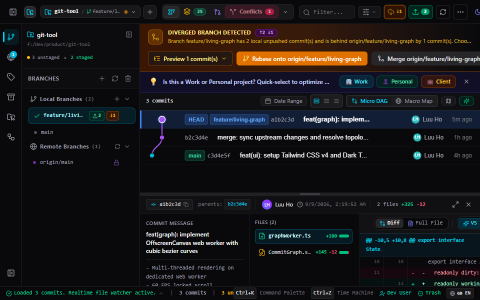
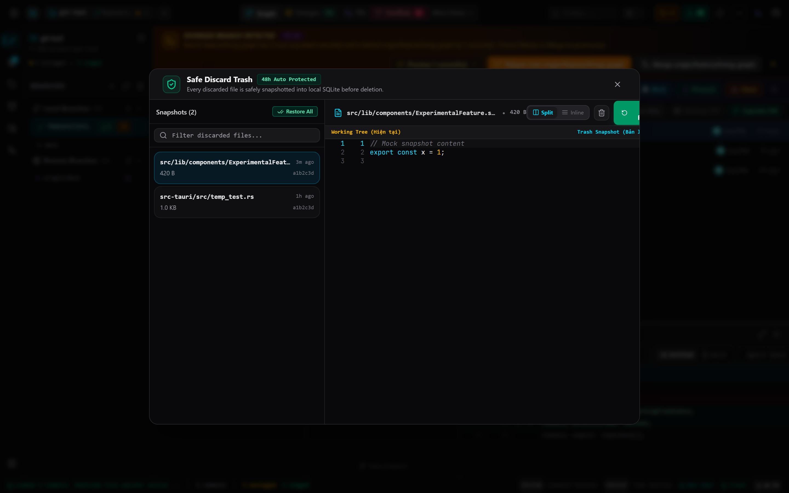
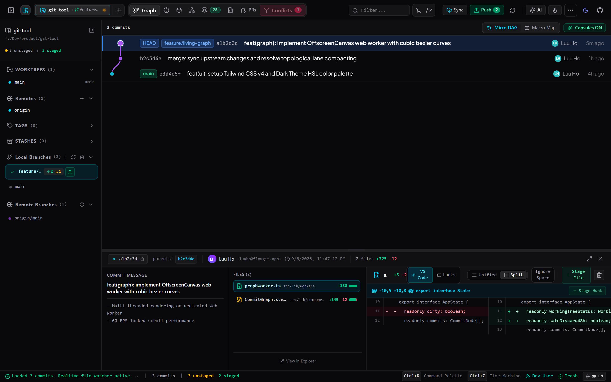
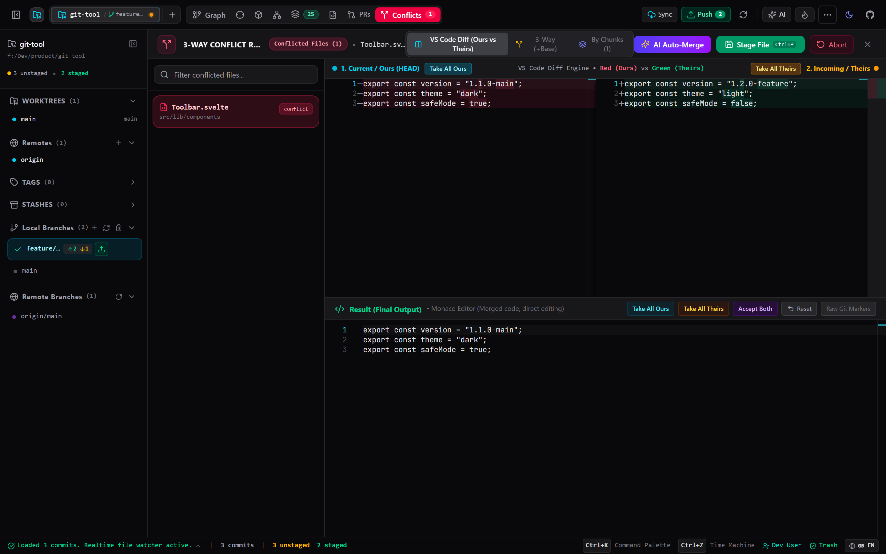
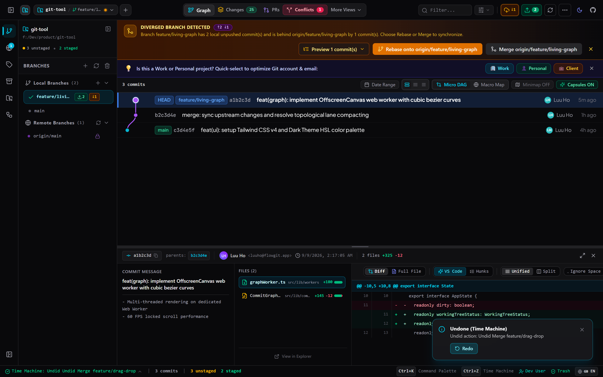

<div align="center">

# ⚡ FlowGit
### Next-Generation Visual Git Client | Ứng Dụng Quản Lý Git Đột Phá
**Visual First • Zero Terminal Friction • No-Fear Git**

[](LICENSE)
[](LICENSE)
[](https://v2.tauri.app/)
[](https://svelte.dev/)
[](https://www.rust-lang.org/)
[]()
[]()

<br/>

**[ 🇬🇧 Read in English ](#-english)** &nbsp;•&nbsp; **[ 🇻🇳 Đọc Tiếng Việt ](#-tiếng-việt)**

<br/>
<br/>



<br/>

</div>

---

<a name="-english"></a>
# 🇬🇧 English

## 🚀 Why FlowGit? (Overview & Value Proposition)

Most modern Git GUIs (GitKraken, GitHub Desktop, SourceTree) are built on heavy Electron runtimes that easily consume **500MB – 1.5GB of RAM**, lag on repositories with tens of thousands of commits, and offer zero safety net when users accidentally run a destructive `git reset --hard` or `git checkout -- .`.

**FlowGit** was re-engineered from the ground up for 2026:
- **⚡ Blazing Fast & Ultra Lightweight:** Native **Rust** core (`libgit2`) + **Tauri v2** webview. Starts in under **400ms** and consumes **< 85MB RAM**.
- **🛡️ 100% No-Fear Git:** Never lose uncommitted work again. Includes an automated **48-Hour Safe Discard Trash** and full **Time Machine Undo (`Ctrl + Z`)**.
- **📊 60 FPS Locked Commit Graph:** Hardware-accelerated rendering using `OffscreenCanvas` in a dedicated Web Worker. Handles repositories with **> 100,000 commits** without dropping a single frame on the UI thread.
- **✨ Zero-Terminal Friction:** Visual drag-and-drop rebasing with **In-Memory Ghost Preview** that detects conflicts before you even release your mouse button.
- **🔄 Zero-VPS Auto Updates:** Native updates signed with **Ed25519 cryptographic keys**, distributed via GitHub Releases with zero server hosting costs.

---

### 📊 Benchmark & Comparison

| Feature / Metric | ⚡ FlowGit (Tauri v2 + Rust) | 🐌 Electron-based GUIs | 🏛️ Legacy GUIs (SourceTree) |
| :--- | :---: | :---: | :---: |
| **Idle Memory Usage** | **~75 MB** | 600 MB – 1.2 GB | ~350 MB |
| **Startup Time** | **< 0.5s** | 3.5s – 7.0s | 4.0s – 8.0s |
| **Commit Graph Engine** | **OffscreenCanvas + Web Worker** | DOM / SVG (Laggy at 10k+) | Native Direct2D / GDI |
| **Accidental Discard Recovery** | **✅ 48-Hour SQLite Trash** | ❌ Lost forever | ❌ Lost forever |
| **Action Undo (`Ctrl + Z`)** | **✅ Full Time Machine** | ⚠️ Partial / None | ❌ No |
| **Conflict Dry-Run Simulation** | **✅ In-Memory Ghost Preview** | ❌ Trial & Error | ❌ Trial & Error |
| **Code & Diff Editor** | **Monaco Editor (VS Code)** | Custom / Basic Diff | Basic Text Diff |
| **Bilingual (VI / EN)** | **✅ 100% Native Dual Locales** | ⚠️ Machine translated | ❌ English only |

---

## 🌟 Key Features

### 1. 📊 Living Commit Graph (60 FPS Locked)
- Rendered via HTML5 `OffscreenCanvas` isolated in a dedicated Web Worker (`graphWorker.ts`).
- Bézier curve topological lanes computed in parallel with Rust (`rayon`).
- Zero main-thread UI jank, even with gigantic repositories like the Linux kernel or Chromium.

### 2. 🛡️ No-Fear Git: 48h Safe Discard & Time Machine Undo (`Ctrl + Z`)
- **Safe Discard 48h:** Every discarded hunk or file is automatically snapshot into an encrypted SQLite database before truncation. Restore any discarded file within 48 hours via the Trash Inspector.
- **Reflog Time Machine:** Press `Ctrl + Z` to undo destructive actions (accidental hard resets, wrong branch checkouts, or messy rebases) safely without CLI expertise.

### 3. 🔀 Drag & Drop Interactive Rebase with Ghost Conflict Preview
- Reorder commits simply by dragging them in the timeline.
- Select multiple commits and press `S` to squash.
- **Ghost Preview:** Uses `git2-rs` in-memory trees to simulate the rebase result and displays instant conflict warnings before mouse release.

### 4. ⚔️ 4-Way Visual Conflict Resolver
- Visual side-by-side display of **Ours**, **Base**, **Theirs**, and the live **Result**.
- One-click block picking with integrated syntax highlighting powered by Monaco Editor.

### 5. 🐙 Integrated GitHub PR Workspace
- Inspect pull requests, read reviews, examine Monaco diffs, review CI/CD check runs, checkout PR branches, and merge directly inside FlowGit without switching to the browser.

### 6. 🐞 Visual Git Bisect Wizard
- Automatically bisects your graph history to track down regression bugs in 4–5 guided visual steps.

### 7. 🧹 Sensitive File Nuker (.env Purge)
- Wipe credentials, API keys, or large binary files entirely from your repository's commit history with automated rewriting.

### 8. 🔄 Free Auto-Updater (Powered by GitHub Releases)
- 100% free auto-update pipeline without VPS dependencies.
- Cryptographically verified with **Ed25519 signatures** to prevent tampering.
- Background checks with non-intrusive update modal and one-click download & restart.

---

### 📸 Visual Feature Showcase

| 🛡️ 48-Hour Safe Discard Trash | ⚡ Side-by-Side Monaco Diff |
| :---: | :---: |
|  |  |
| **⚔️ 4-Way Conflict Resolver** | **⏳ Reflog Time Machine (`Ctrl + Z`)** |
|  |  |

---

## 🛠️ Technical Architecture

```
┌───────────────────────────────────────────────────────────┐
│              Svelte 5 SPA Frontend (Vite)                 │
│  - Runes: $state.raw, $derived, $effect                   │
│  - Monaco Editor + Monaco Diff Engine                     │
│  - Tailwind CSS v4 + Bits UI                              │
└──────────────┬─────────────────────────────┬──────────────┘
               │ Zero-Copy IPC               │ Offscreen Transfer
               ▼                             ▼
┌──────────────────────────────┐ ┌───────────────────────────┐
│     Tauri v2 Rust Backend    │ │     Graph Web Worker      │
│  - libgit2 (git2-rs)         │ │  - OffscreenCanvas        │
│  - Rayon (Multi-threaded)    │ │  - Bézier Splines         │
│  - SQLite (48h Trash/Undo)   │ │  - 60 FPS Virtual Scroll  │
│  - Tokio Async Network / FS  │ └───────────────────────────┘
│  - Ed25519 Updater Plugin    │
└──────────────────────────────┘
```

---

## 💻 Quick Start & Build

### Prerequisites
- **Node.js** `>= 20.x`
- **Rust Toolchain** `>= 1.80` (Edition 2021/2024)
- **C++ Build Tools** (MSVC on Windows for building `libgit2`)

### Development
```bash
# 1. Install dependencies
npm install

# 2. Run in development mode with HMR
npm run tauri dev
```

### Production Build
```bash
# Build standalone Windows installer (.exe & .msi)
npm run tauri build
```

See [CONTRIBUTING.md](CONTRIBUTING.md) for detailed guidelines on local setup, golden rules, and pull request workflow.
Output files are generated in `src-tauri/target/release/bundle/nsis/`.

---

<br/><br/>

---

<a name="-tiếng-việt"></a>
# 🇻🇳 Tiếng Việt

## 🚀 Tại Sao Chọn FlowGit? (Tổng Quan & Lợi Ích Cốt Lõi)

Hầu hết các phần mềm Git GUI hiện nay (GitKraken, GitHub Desktop, SourceTree) đều xây dựng trên nền tảng Electron cồng kềnh, ngốn từ **500MB đến 1.5GB RAM**, thường xuyên giật lag khi mở kho chứa lớn và **hoàn toàn bất lực** khi lập trình viên lỡ tay bấm nhầm `git reset --hard` hoặc xóa nhầm code chưa commit.

**FlowGit** được thiết kế lại toàn diện theo chuẩn công nghệ 2026:
- **⚡ Siêu Nhanh & Nhẹ:** Lõi **Rust** (`libgit2`) kết hợp **Tauri v2**. Khởi động tức thì trong **< 0.5 giây**, ngốn chưa tới **85MB RAM**.
- **🛡️ Tuyệt Đối An Toàn (No-Fear Git):** Không bao giờ sợ mất mã nguồn. Tích hợp **Thùng rác Uncommitted Changes 48h** và cỗ máy thời gian **Hoàn tác `Ctrl + Z` (Undo)**.
- **📊 Đồ Thị Động Học 60 FPS:** Render đồ thị bằng `OffscreenCanvas` trên Web Worker riêng biệt. Cân mượt mà repo trên **100.000 commits** mà không làm đơ giao diện.
- **✨ Kéo - Thả Trực Quan (Zero Terminal Friction):** Rebase và đổi thứ tự commit bằng kéo thả, tích hợp **Ghost Preview** cảnh báo xung đột ngay trước khi thả chuột.
- **🔄 Tự Động Cập Nhật 0 Đồng (Zero-VPS):** Kiểm tra và tải cập nhật tự động qua GitHub Releases với chữ ký số bảo mật **Ed25519**, không tốn 1 đồng chi phí duy trì máy chủ.

---

### 📊 Bảng So Sánh Chi Tiết

| Tiêu Chí / Tính Năng | ⚡ FlowGit (Tauri v2 + Rust) | 🐌 Ứng Dụng Electron | 🏛️ Git GUI Cũ (SourceTree) |
| :--- | :---: | :---: | :---: |
| **Mức Chiếm Dụng RAM** | **~75 MB** | 600 MB – 1.2 GB | ~350 MB |
| **Thời Gian Mở App** | **< 0.5 giây** | 3.5s – 7.0s | 4.0s – 8.0s |
| **Động Cơ Vẽ Graph** | **OffscreenCanvas + Web Worker** | DOM / SVG (Đơ lag khi repo lớn) | GDI / Direct2D cũ |
| **Cứu Code Discard Nhầm** | **✅ Thùng rác SQLite 48h** | ❌ Mất vĩnh viễn | ❌ Mất vĩnh viễn |
| **Hoàn Tác Nhanh (`Ctrl + Z`)** | **✅ Time Machine Toàn Diện** | ⚠️ Hạn chế / Không có | ❌ Không hỗ trợ |
| **Mô Phỏng Xung Đột Trước** | **✅ In-Memory Ghost Preview** | ❌ Thử sai trực tiếp | ❌ Thử sai trực tiếp |
| **Trình So Sánh Mã Nguồn** | **Monaco Editor (Chuẩn VS Code)** | Trình xem Diff cơ bản | Giao diện text cổ điển |
| **Hỗ Trợ Song Ngữ (VI/EN)** | **✅ 100% Bản Ngữ Chuẩn Dev** | ⚠️ Dịch máy ngô nghê | ❌ Chỉ có tiếng Anh |

---

## 🌟 Các Tính Năng Đột Phá

### 1. 📊 Living Commit Graph (Khóa Cứng 60 FPS)
- Sử dụng `OffscreenCanvas` tách biệt hoàn toàn trên Web Worker (`graphWorker.ts`).
- Thuật toán tính toán đường cong Bézier chạy song song đa luồng bằng Rust (`rayon`).
- Đảm bảo thanh cuộn luôn mượt mà 60 FPS ngay cả với những repo khổng lồ.

### 2. 🛡️ No-Fear Git: Thùng Rác 48h & Hoàn Tác Time Machine (`Ctrl + Z`)
- **Safe Discard 48h:** Mỗi khi bạn bấm Discard một file hoặc một đoạn code (hunk), FlowGit tự động snapshot vào SQLite trước khi xóa. Bạn có thể khôi phục lại nguyên vẹn trong vòng 48 giờ qua giao diện Trash.
- **Undo `Ctrl + Z`:** Dễ dàng hoàn tác các thao tác nguy hiểm (Reset nhầm, checkout sai nhánh, rebase hỏng) dựa trên `git reflog` và Action Journal.

### 3. 🔀 Kéo - Thả Interactive Rebase & Ghost Conflict Preview
- Đổi thứ tự commit trực tiếp bằng cách kéo thả node trên timeline.
- Bôi đen nhiều commit và ấn phím `S` để gộp (Squash).
- **Ghost Preview:** Mô phỏng kết quả rebase ngay trên bộ nhớ RAM (In-Memory Tree) bằng `git2-rs`, cảnh báo xung đột tức thì trước khi thả chuột.

### 4. ⚔️ Trình Giải Quyết Xung Đột 4 Khung Hình (Conflict Resolver)
- Phân tách trực quan 4 vùng: **Ours (Mã của bạn)**, **Base (Gốc)**, **Theirs (Mã nhánh gộp)** và **Result (Kết quả)**.
- Nhận từng khối mã chỉ với 1 click chuột, hỗ trợ highlight cú pháp thông minh của Monaco Editor.

### 5. 🐙 Không Gian Đánh Giá GitHub Pull Request Toàn Diện
- Duyệt PRs, xem Monaco diffs, đọc comment, theo dõi trạng thái CI/CD checks (GitHub Actions), checkout nhánh PR và merge trực tiếp mà không cần rời ứng dụng.

### 6. 🐞 Trình Truy Vết Lỗi Tự Động (Visual Git Bisect Wizard)
- Tự động chia đôi lịch sử commit, hướng dẫn từng bước kiểm tra để tìm ra commit gây lỗi chỉ sau 4–5 lần bấm chuột.

### 7. 🧹 Tẩy Xóa Tệp Nhạy Cảm Khỏi Lịch Sử (History Nuker)
- Xóa triệt để các file nhạy cảm lỡ commit (.env, API keys, private keys, database dump nặng) khỏi toàn bộ lịch sử Git một cách an toàn.

### 8. 🔄 Tự Động Cập Nhật Không Cần VPS (GitHub Releases)
- Tự động kiểm tra và tải bản cài đặt ngầm.
- Xác thực bằng chữ ký mật mã **Ed25519**, chống giả mạo mã độc.
- Băng thông và lưu trữ được GitHub bảo trợ miễn phí 100%.

---

### 📸 Hình Ảnh Giao Diện Tính Năng Thực Tế

| 🛡️ Thùng Rác Safe Discard 48h | ⚡ Trình So Sánh Code Monaco Diff |
| :---: | :---: |
|  |  |
| **⚔️ Trình Giải Quyết Xung Đột 4 Vùng** | **⏳ Cỗ Máy Thời Gian Hoàn Tác (`Ctrl + Z`)** |
|  |  |

---

## 🛠️ Kiến Trúc Kỹ Thuật

FlowGit được chia thành 2 tầng xử lý cách ly để tối ưu hiệu năng tối đa:
1. **Frontend (Svelte 5 + Runes):**
   - Quản lý trạng thái bằng Class-based State Runes (`$state`, `$state.raw`, `$derived`).
   - Sử dụng `$state.raw` cho mảng lịch sử commit hàng trăm nghìn phần tử nhằm triệt tiêu hoàn toàn chi phí Proxy overhead.
   - Trình biên tập diff và code xem trước sử dụng Monaco Editor.
2. **Backend (Rust + Tauri v2):**
   - Tương tác Git thuần bản địa qua `git2-rs` (C-bindings của libgit2), không phụ thuộc Git CLI ngoài máy.
   - Đa luồng Rayon tính toán vị trí lane commit graph song song.
   - Lưu trữ cục bộ SQLite lưu vết Thùng rác 48h và Action Log.
   - IPC Zero-Copy serialization truyền dữ liệu siêu tốc giữa Rust và WebView.

---

## 💻 Hướng Dẫn Cài Đặt & Phát Triển

### Yêu Cầu Môi Trường
- **Node.js** `>= 20.x`
- **Rust Toolchain** `>= 1.80` (Edition 2021/2024)
- **C++ Build Tools** (MSVC trên Windows)

### Khởi Chạy Thử Nghiệm (Development)
```bash
# 1. Cài đặt các gói phụ thuộc
npm install

# 2. Khởi chạy ứng dụng với Hot Module Replacement
npm run tauri dev
```

### Đóng Gói Cài Đặt (Build Installer)
```bash
# Đóng gói bộ cài đặt Windows (.exe & .msi)
npm run tauri build
```
File cài đặt sau khi build sẽ nằm tại: `src-tauri/target/release/bundle/nsis/`.

> Xem thêm [Hướng dẫn đóng góp (CONTRIBUTING.md)](CONTRIBUTING.md) để biết chi tiết cách thiết lập môi trường, quy chuẩn kiểm thử và gửi PR.

---

## 📚 Hệ Thống Tài Liệu Kiến Trúc Chi Tiết

Dự án sở hữu kho 22 tài liệu đặc tả kỹ thuật chi tiết tại thư mục [`docs/`](./docs/README.md):
- 📖 [docs/README.md](./docs/README.md): Bản đồ tổng quan toàn bộ dự án.
- 🏗️ [docs/architecture/overview.md](./docs/architecture/overview.md): Kiến trúc chuyên sâu Tauri v2 + Rust.
- 🎨 [docs/architecture/offscreen-canvas-graph.md](./docs/architecture/offscreen-canvas-graph.md): Cơ chế OffscreenCanvas 60 FPS.
- 🔌 [docs/architecture/ipc-api-reference.md](./docs/architecture/ipc-api-reference.md): Danh mục 70+ Tauri IPC Commands.
- 🛡️ [docs/architecture/safety-engine.md](./docs/architecture/safety-engine.md): Động cơ Safe Discard & Time Machine.

---

## 📄 Bản Quyền (License)

Dự án phát triển mã nguồn mở theo chuẩn giấy phép [MIT License](LICENSE).
