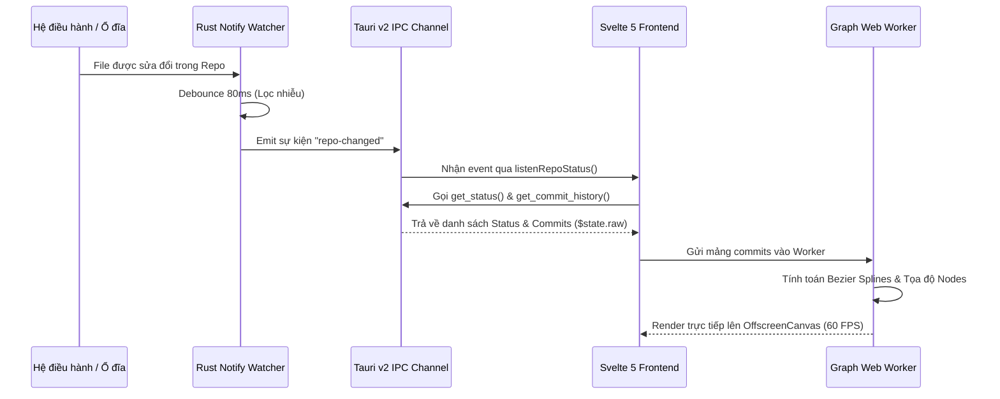

# KIẾN TRÚC TỔNG THỂ HỆ THỐNG FLOWGIT (SYSTEM ARCHITECTURE)
> **Kiến trúc:** Tauri v2 Native Bridge + Svelte 5 Runes SPA + Rust Core Engine  
> **Cập nhật:** Chuẩn công nghệ 2026 – Tối ưu hóa Monorepo & Concurrency

---

## 🏗️ 1. SƠ ĐỒ KHỐI TỔNG THỂ (HIGH-LEVEL ARCHITECTURE)

Hệ thống FlowGit được thiết kế theo mô hình tách biệt nghiêm ngặt giữa tầng giao diện hiển thị (Presentation Layer), tầng tính toán đồ họa đa luồng (Worker Layer), tầng API mạng (GitHub Client) và tầng xử lý nghiệp vụ bản địa (Native Backend Core):

```
┌─────────────────────────────────────────────────────────────────────────────────────────┐
│ FRONTEND (Svelte 5 SPA + Tailwind CSS v4 + Bits UI + Monaco Editor)                     │
│                                                                                         │
│  ┌─────────────────────────────────┐   ┌──────────────────────────────────────────────┐ │
│  │ MAIN UI THREAD (DOM Rendering)  │   │ DEDICATED WEB WORKER (OffscreenCanvas)       │ │
│  │ ├── 3-Column Split Layout       │   │ ├── Bezier Curves Spline Rendering (60 FPS) │ │
│  │ ├── Sidebar & Repository Tree   │   │ ├── Multi-Lane Topological Routing           │ │
│  │ ├── Monaco Diff & Code Editors  │◄──┼─ Matrix Coordinate Mapping (Screen <-> Graph)│ │
│  │ ├── PR Reviewer & Explorer Hub  │   │ └── Virtual Viewport Caching                 │ │
│  │ └── Svelte 5 Rune State Stores  │   └──────────────────────────────────────────────┘ │
│  │     (Repo, WorkingTree, Safety) │                                                    │
│  └────────────────┬────────────────┘                                                    │
│                   │ REST API (HTTPS)                                                    │
│                   ▼                                                                     │
│  ┌─────────────────────────────────────────────────────────┐                            │
│  │ GITHUB CLIENT LAYER (src/lib/api/githubApi.ts)          │                            │
│  │ ├── Octokit-less Native Fetch Engine                    │                            │
│  │ ├── Pull Request Review, Checks & Comments Management   │                            │
│  │ └── Instant Push Detection & One-Click Publishing       │                            │
│  └─────────────────────────────────────────────────────────┘                            │
└───────────────────┼─────────────────────────────────────────────────────────────────────┘
                    │ Tauri v2 IPC Channel (Scoped Capability Permissions, Zero-Copy JSON)
┌───────────────────┴─────────────────────────────────────────────────────────────────────┐
│ BACKEND CORE (Rust Native Engine - 70+ IPC Commands)                                    │
│                                                                                         │
│  ┌───────────────────────────────┐  ┌─────────────────────────────────────────────────┐ │
│  │ TAURI IPC DISPATCHER LAYER    │  │ PARALLEL WORKERS & EVENT RUNTIME                │ │
│  │ ├── src/commands/action.rs    │  │ ├── Tokio Async Runtime (Long-running Network)  │ │
│  │ ├── src/commands/diff.rs      │  │ ├── Rayon Multi-thread Pool (Lane Compaction)   │ │
│  │ ├── src/commands/repo.rs      │  │ └── Realtime File Watcher (`notify` crate)      │ │
│  │ └── src/commands/auth.rs      │  └─────────────────────────────────────────────────┘ │
│  └───────────────┬───────────────┘                                                      │
│                  ▼                                                                      │
│  ┌────────────────────────────────────────────────────────────────────────────────────┐ │
│  │ GIT2 CORE ENGINE (`libgit2-rs` Bindings)                                           │ │
│  │ ├── Monorepo Chunked Revwalk (500 commits / chunk, lazy pagination)                │ │
│  │ ├── In-Memory Simulation Engine (Dry-Run Conflict Check via `git2::Index`)         │ │
│  │ ├── Submodules Inspector (`.gitmodules`) & Git LFS Pointer Parser                  │ │
│  │ ├── Stacked Commits Sequencer & History Nuker Engine                               │ │
│  │ └── Interactive Rebase Sequencer (`git2::Repository::rebase_init`)                │ │
│  └───────────────────────────────┬────────────────────────────────────────────────────┘ │
│                                  ▼                                                      │
│  ┌────────────────────────────────────────────────────────────────────────────────────┐ │
│  │ LOCAL PERSISTENCE LAYER (`rusqlite` SQLite 3)                                      │ │
│  │ ├── Safe Discard Trash Snapshots (Automatic 48-Hour TTL Eviction)                  │ │
│  │ ├── Action History & Undo Journal (Reflog Time-Travel Synchronization)            │ │
│  │ └── Secure Account Store (Personal Access Tokens & SSH Metadata)                   │ │
│  └────────────────────────────────────────────────────────────────────────────────────┘ │
└─────────────────────────────────────────────────────────────────────────────────────────┘
```

---

## 🎨 2. KIẾN TRÚC FRONTEND (SVELTE 5 RUNES)

### 2.1. Quản lý trạng thái bằng Svelte 5 Runes
FlowGit áp dụng **100% Svelte 5 Runes** dạng Class-based Reactive Stores trong thư mục `src/lib/state/`:

1. **`RepoState` (`src/lib/state/repoState.svelte.ts`):**
   - Quản lý danh sách commit, branches, tags, stashes, HEAD pointer và tiến trình phân trang (`hasMoreCommits`, `isLoadingHistory`).
   - Sử dụng **`$state.raw<CommitNode[]>`** để lưu trữ danh sách hàng chục nghìn commits. Bằng cách này, Svelte 5 không tạo Proxy cho từng thuộc tính của commit node, giúp tiết kiệm hơn 80% bộ nhớ RAM và triệt tiêu độ trễ khi duyệt cây.
2. **`WorkingTreeState` (`src/lib/state/workingTreeState.svelte.ts`):**
   - Lưu trữ danh sách file đã thay đổi (`dirtyFiles`), trạng thái staged/unstaged, tệp đang chọn xem diff và cấu hình bỏ qua file (`.gitignore`).
3. **`RemoteState` (`src/lib/state/remoteState.svelte.ts`):**
   - Quản lý các Remote URL (`origin`, `upstream`), danh sách tài khoản đã xác thực (GitHub, GitLab) và chỉ số chênh lệch Ahead/Behind.
4. **`GitSafetyState` (`src/lib/state/gitSafetyState.svelte.ts`):**
   - Điều khiển ngăn kéo **Time Machine Drawer (`Ctrl + Z`)** và danh mục các bản lưu trữ trong **Safe Recycle Bin (Trash Inspector)**.
5. **`ThemeState` (`src/lib/state/themeState.svelte.ts`):**
   - Quản lý Dark/Light mode, màu nhấn (accent color) và tích hợp đồng bộ theme với Monaco Editor.
6. **`ToastState` (`src/lib/state/toastState.svelte.ts`):**
   - Hệ thống thông báo toast toàn cục hỗ trợ hiển thị lỗi có thể copy, cảnh báo conflict và tiến trình đồng bộ.

### 2.2. Trình soạn thảo Monaco Editor & Monaco Diff Editor
- Tích hợp phiên bản tối ưu của **Monaco Editor** cho các chức năng:
  - `MonacoDiffEditor.svelte`: So sánh diff giữa working tree và index, hoặc giữa 2 commit bất kỳ (`ComparisonViewer`), hỗ trợ chế độ Split/Unified.
  - `MonacoEditor.svelte`: Xem trước mã nguồn trong `RepositoryExplorer`, tích hợp cột Gutter hiển thị Git Blame realtime.

### 2.3. Kiến trúc Render Đồ thị Phân lập (Worker + Canvas)
- Chi tiết xem tại tài liệu kiến trúc chuyên sâu: [`docs/architecture/offscreen-canvas-graph.md`](./offscreen-canvas-graph.md).
- Toàn bộ thuật toán tính toán tọa độ $X, Y$, tính toán đường cong Bezier Cubic Spline và lệnh vẽ Canvas được đưa vào **`src/lib/workers/graphWorker.ts`**.
- Đảm bảo UI main-thread luôn phản hồi người dùng ở tốc độ **60 FPS** ổn định ngay cả khi đang cuộn qua 100,000 commits.

---

## 🦀 3. KIẾN TRÚC BACKEND (TAURI V2 & RUST CORE)

### 3.1. Phân tầng Module Backend
Cấu trúc mã nguồn Rust trong thư mục `src-tauri/src/` được chia thành các phân khu rõ ràng:
- **`commands/`:** Điểm tiếp nhận và điều phối hơn 70 IPC commands từ Frontend. Tất cả các command đều trả về kiểu `Result<T, AppError>`, nghiêm cấm sử dụng `unwrap()` hoặc `expect()` để bảo đảm ứng dụng không bao giờ bị crash đột ngột.
- **`git/`:** Thư viện logic Git tương tác trực tiếp với `git2-rs`. Bao gồm các thuật toán tính toán lịch sử, đồ thị lane đa luồng, mô phỏng Dry-run, xử lý conflict, rebase, blame, stacked commits và quản lý LFS.
- **`storage/`:** Tầng cơ sở dữ liệu SQLite bản địa (`rusqlite`), phụ trách lưu trữ Trash 48h (`trash.rs`), nhật ký hành động (`action_log.rs`) và thông tin tài khoản (`accounts.rs`).
- **`watcher/`:** Lớp giám sát tập tin (`notify`) chạy ngầm, gửi sự kiện `repo-changed` lên Frontend khi có bất kỳ thay đổi nào trong working tree hoặc thư mục `.git/`.

### 3.2. Đa luồng và Xử lý Bất đồng bộ
1. **Rayon Multi-Threading:**
   - Trong quá trình duyệt commit history (`history.rs`), thuật toán gán làn (Lane Assignment) và nén topological lanes được phân bổ xử lý song song trên nhiều core CPU bằng `rayon::par_iter()`.
2. **Tokio Async Runtime:**
   - Các thao tác mạng đường truyền dài (Fetch, Pull, Push, Clone, GitHub Device OAuth Poll) được đóng gói trong các tác vụ bất đồng bộ của Tokio, tránh khóa cứng luồng IPC chính của Tauri.
3. **In-Memory Git Index Simulation:**
   - Trước khi thực hiện Rebase, Merge hoặc Cherry-pick, hệ thống khởi tạo một `git2::Index` giả lập hoàn toàn trong bộ nhớ RAM để kiểm tra xem có xung đột mã nguồn xảy ra hay không mà không làm xáo trộn working tree thực tế của người dùng.

---

## ⚡ 4. VÒNG ĐỜI SỰ KIỆN VÀ ĐỒNG BỘ REALTIME (DATA FLOW)



Kiến trúc này giúp FlowGit giữ được tốc độ phản hồi tính bằng mili-giây, giao diện mượt mà và an toàn tối đa trên mọi nền tảng Windows, macOS và Linux.
