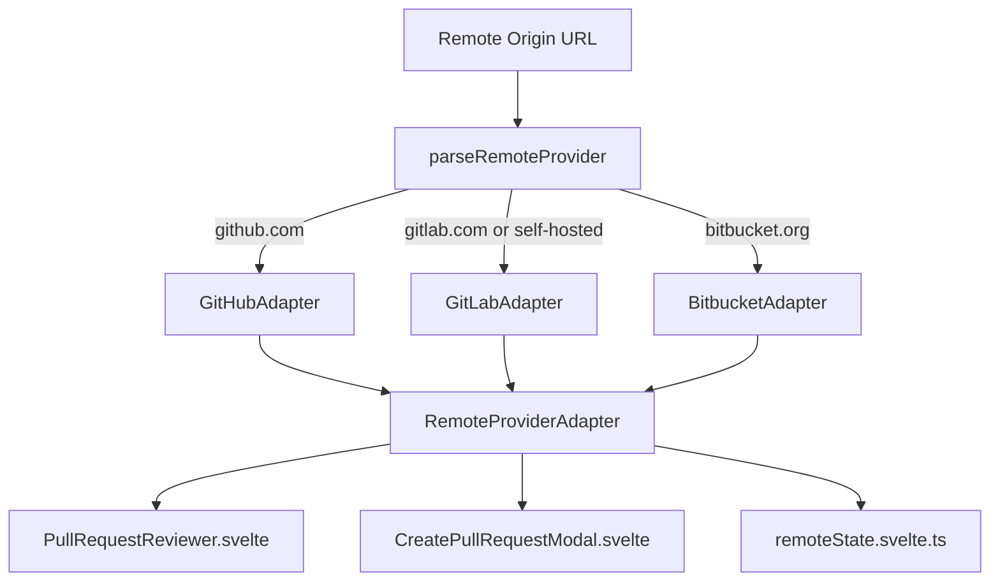

<div align="center">

# 🌐 Multi-Cloud Remote Providers & Commit Signing Studio
### Tích Hợp Đa Nền Tảng (GitHub, GitLab, Bitbucket) & Ký Commit Bảo Mật (GPG / SSH)

> **Standard:** 2026 Next-Gen Enterprise Security & Multi-Cloud Workspace  
> **Backend Engine:** Rust (`git2-rs` header parsing & configuration, Rayon)  
> **Frontend:** Svelte 5 Runes + Provider Adapter Pattern (`remoteProviderApi.ts`)  

**[ 🇬🇧 Read in English ](#-english)** &nbsp;•&nbsp; **[ 🇻🇳 Đọc Tiếng Việt ](#-tiếng-việt)**

</div>

---

<a name="-english"></a>
# 🇬🇧 English

## 1. Overview & Architectural Motivation

Modern software engineering teams frequently collaborate across multiple Git hosting services: **GitHub**, **GitLab** (including private self-hosted enterprise instances), and **Bitbucket**. Previously, Git clients often favored a single platform (typically GitHub) or forced developers to install distinct third-party plugins.

Simultaneously, enterprise security mandates require cryptographic verification of every commit to prevent commit spoofing and unauthorized code injection. FlowGit introduces two integrated systems:
1. **Universal Remote Provider Adapter Pattern (`remoteProviderApi.ts`)**: A polymorphic abstraction layer normalizing Pull Requests (GitHub/Bitbucket) and Merge Requests (GitLab) into a single, unified review interface.
2. **Cryptographic Commit Signing Engine (`signing.rs`)**: Native `git2-rs` inspection of raw commit headers (`gpgsig`), instant discovery of local SSH public keys (`~/.ssh/*.pub`), 1-click configuration in `IdentitySwitcherModal`, and verification shield badges on `CommitDetail`.

---

## 2. Universal Remote Provider Architecture



### Supported Providers & URL Detection

The parser handles both SSH (`git@...`) and HTTPS (`https://...`) URLs across arbitrary domains:
- **GitHub**: Matches `github.com/:owner/:repo.git`. Uses GitHub REST API v3.
- **GitLab**: Matches `gitlab.com` or custom enterprise hosts (`gitlab.mycorp.internal`). Automatically maps API calls to `https://{host}/api/v4/projects/{owner%2Frepo}/merge_requests`.
- **Bitbucket**: Matches `bitbucket.org/:workspace/:repo.git`. Maps to Bitbucket 2.0 REST API `/repositories/{workspace}/{repo}/pullrequests`.

### Unified Interface (`RemoteProviderAdapter`)

```typescript
export interface RemoteProviderAdapter {
  readonly providerInfo: RemoteProviderInfo;
  getLabel(): string; // "GitHub" | "GitLab" | "Bitbucket"
  getPRTerm(): string; // "Pull Request" vs "Merge Request"
  fetchPullRequests(state?: 'open' | 'closed' | 'all', token?: string): Promise<GitHubPullRequest[]>;
  fetchPullRequestFiles(pullNumber: number, token?: string): Promise<GitHubPRFile[]>;
  fetchPullRequestComments(pullNumber: number, token?: string): Promise<GitHubPRComment[]>;
  createPullRequest(options: CreatePROptions): Promise<GitHubPullRequest>;
  mergePullRequest?(pullNumber: number, method?: 'merge' | 'squash' | 'rebase', commitMsg?: string, token?: string): Promise<{ merged: boolean; message: string }>;
  closePullRequest?(pullNumber: number, token?: string): Promise<void>;
}
```

---

## 3. Cryptographic Commit Signing (SSH & GPG)

### Native Rust Header Inspection

Git commits embed signatures directly into their raw commit object header field labeled `gpgsig`. FlowGit extracts this without running external terminal processes:

```rust
pub fn get_commit_signature(repo: &Repository, commit_id: &str) -> AppResult<SignatureInfo> {
    let commit = repo.find_commit(Oid::from_str(commit_id)?)?;
    if let Some(buf) = commit.header_field_bytes("gpgsig").ok() {
        let sig_str = String::from_utf8_lossy(&buf).to_string();
        let key_type = if sig_str.contains("SSH SIGNATURE") {
            "ssh"
        } else if sig_str.contains("PGP SIGNATURE") {
            "gpg"
        } else {
            "unknown"
        };
        return Ok(SignatureInfo { is_signed: true, key_type: Some(key_type.into()), signature: Some(sig_str), signer: commit.author().name().map(Into::into) });
    }
    Ok(SignatureInfo { is_signed: false, key_type: None, signature: None, signer: None })
}
```

### Local SSH Key Auto-Discovery

FlowGit scans the user's `~/.ssh/` directory (`$USERPROFILE/.ssh` on Windows or `$HOME/.ssh` on Unix) for `.pub` files (e.g. `id_ed25519.pub`, `id_rsa.pub`), presenting them in a convenient dropdown selector so users do not need to memorize terminal commands or manually copy absolute paths.

---

## 4. UI/UX Workflows

### CommitDetail Verified Badge
When inspecting any signed commit:
- Displays a `🛡️ Verified (SSH)` or `🛡️ Verified (GPG)` shield badge in the commit detail bar.
- Clicking the badge opens a cryptographic verification popover displaying signer identity, key format, and raw armored signature with a 1-click copy action.

### Identity Switcher Modal — Signing Tab
- **Tab 1 (Author Profiles)**: Manage local/global `user.name` and `user.email`.
- **Tab 2 (Commit Signing)**:
  - Toggle `commit.gpgsign` (true/false).
  - Select format: **SSH Key (Git 2.34+, recommended)** vs **GPG / OpenPGP**.
  - Dropdown populated with discovered local public keys.
  - Choose scope: Local repository (`.git/config`) or Global (`~/.gitconfig`).

---

<a name="-tiếng-việt"></a>
# 🇻🇳 Tiếng Việt

## 1. Tổng Quan & Động Lực Phát Triển

Trong môi trường doanh nghiệp hiện đại, lập trình viên thường xuyên làm việc song song với nhiều nền tảng Git khác nhau: **GitHub**, **GitLab** (kể cả GitLab Self-Hosted cài đặt nội bộ trong mạng công ty), và **Bitbucket**. Các Git client truyền thống thường chỉ ưu tiên GitHub, khiến việc theo dõi và đánh giá mã nguồn trên GitLab hoặc Bitbucket gặp nhiều trở ngại.

Đồng thời, quy chuẩn bảo mật Enterprise đòi hỏi toàn bộ mã nguồn phải được **ký số xác thực (Commit Signing)** bằng GPG hoặc SSH key để chứng minh nguồn gốc commit và ngăn chặn giả mạo danh tính tác giả (`author spoofing`). FlowGit triển khai trọn vẹn giải pháp:
1. **Kiến trúc Adapter Đa Nền Tảng (`remoteProviderApi.ts`)**: Chuẩn hóa toàn bộ API của GitHub, GitLab và Bitbucket về cùng một giao diện review PR/MR trực quan.
2. **Hệ Thống Ký Số Mật Mã Bản Địa (`signing.rs`)**: Đọc trực tiếp header `gpgsig` trong commit object bằng `git2-rs`, tự động phát hiện SSH public key trong thư mục `~/.ssh/`, hỗ trợ cấu hình 1-click trong `IdentitySwitcherModal`, và hiển thị huy hiệu `Verified 🛡️` trên `CommitDetail`.

---

## 2. Kiến Trúc Adapter Đa Nền Tảng (Remote Provider Adapter)

### Nhận Diện URL Đa Dạng
Bộ phân tích cú pháp `parseRemoteProvider` tự động trích xuất thông tin `owner`, `repo`, và `host` từ cả giao thức HTTPS và SSH:
- **GitHub**: `github.com/:owner/:repo(.git)`
- **GitLab Cloud & On-Premises**: `gitlab.com` hoặc máy chủ nội bộ bất kỳ chứa tên miền `gitlab` (ví dụ `https://gitlab.company.internal/group/repo.git`).
- **Bitbucket**: `bitbucket.org/:workspace/:repo(.git)`.

### Chuẩn Hóa Merge Request & Pull Request
- Trên GitLab: Sử dụng thuật ngữ **Merge Request (MR)**, gọi REST API `/api/v4/projects/:id/merge_requests`, ánh xạ đầy đủ file diffs và ghi chú bình luận (notes).
- Trên GitHub & Bitbucket: Sử dụng thuật ngữ **Pull Request (PR)**, đồng bộ trạng thái mở/đóng và số lượng PR đang chờ xử lý lên thanh công cụ Toolbar.

---

## 3. Cơ Chế Ký Số Commit (SSH & GPG)

### Kiểm Tra Chữ Ký Tốc Độ Cao (Zero CLI Spawn)
Thay vì spawn lệnh `git verify-commit` chậm chạp, FlowGit truy vấn trực tiếp byte header của raw commit object trong libgit2:
- Nếu chứa header `gpgsig`: Tự động phân tích payload chứa `SSH SIGNATURE` hay `PGP SIGNATURE`.
- Hiển thị huy hiệu `Đã xác thực (SSH)` hoặc `Đã xác thực (GPG)` với màu xanh emerald sang trọng.
- Người dùng có thể bấm vào huy hiệu để xem chi tiết người ký và sao chép chuỗi chữ ký số gốc.

### Tự Động Quét Khóa SSH Cục Bộ
Hàm `discover_ssh_keys` tự động quét thư mục `~/.ssh/` trên máy tính của lập trình viên, nhận diện tất cả các file `*.pub` (như `id_ed25519.pub`, `id_rsa.pub`) và hiển thị thành danh sách lựa chọn trong tab **Ký commit (GPG / SSH)** của Modal Danh tính.

---

## 4. Tóm Tắt File Đã Triển Khai

| File | Chức Năng Chính |
| :--- | :--- |
| `src-tauri/src/git/signing.rs` | Logic Rust: `get_commit_signature`, `discover_ssh_keys`, `get_signing_config`, `set_signing_config` |
| `src-tauri/src/commands/repo.rs` | IPC Handlers Tauri v2 cho Commit Signing |
| `src/lib/types.ts` | Khai báo TypeScript types: `SignatureInfo`, `SigningConfig`, `RemoteProviderInfo` |
| `src/lib/api/signing.ts` | API client invoke Tauri v2 cho Commit Signing |
| `src/lib/api/remoteProviderApi.ts` | Bộ Adapter trung gian hỗ trợ GitHub, GitLab, Bitbucket |
| `src/lib/state/remoteState.svelte.ts` | Cập nhật `refreshPRCount` tự thích ứng với mọi Provider |
| `src/lib/components/CommitDetail.svelte` | Hiển thị huy hiệu `🛡️ Verified` và popover kiểm tra chữ ký |
| `src/lib/components/IdentitySwitcherModal.svelte` | Tab cấu hình Ký commit (SSH/GPG) và quét key tự động |
| `src/lib/components/PullRequestReviewer.svelte` | Hỗ trợ review và tạo PR/MR đa nền tảng |
| `src/lib/components/CreatePullRequestModal.svelte` | Modal tạo PR/MR tự động điều chỉnh theo GitHub/GitLab/Bitbucket |
